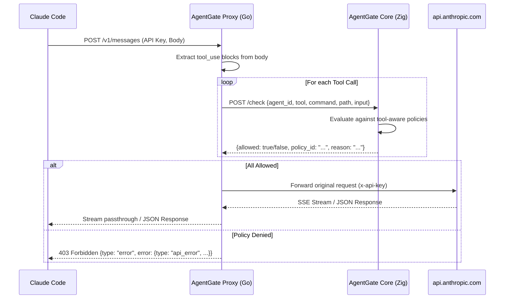

# Implement AI API Proxy and Tool-Aware Policy Enforcement

## Overview

This project extends the AgentGate policy engine by introducing a Go-based AI API proxy. This proxy intercepts requests to the Anthropic API, extracts tool calls, and validates them against a tool-aware policy engine implemented in Zig.

The goal is to move from simple URI/Method enforcement to semantic tool enforcement (e.g., allowing `read` on `/workspace/*` but blocking `bash` commands containing `rm -rf`).

---

## Problem Frame

Current AgentGate policies only understand HTTP metadata (path, method, agent\_id). AI agents using tool-calling capabilities (like Claude Code) send a single `POST /v1/messages` request containing multiple tool invocations in the body. To enforce safety and security policies on these tools, AgentGate needs:
1. A proxy to parse the Anthropic Messages API and extract tool calls.
2. An extended policy engine capable of matching on tool names, command patterns, and target paths.
3. Seamless SSE streaming passthrough to maintain the AI's interactive experience.

---

## Requirements Trace

- R1. Intercept Anthropic API requests and extract `tool_use` blocks.
- R2. Validate each tool call against AgentGate's policy engine via `POST /check`.
- R3. Return Anthropic-compatible error responses on policy denial (403 Forbidden).
- R4. Provide full SSE streaming passthrough for allowed requests.
- R5. Extend Zig policy engine to support tool-aware conditions (`tool`, `tool_pattern`, `command_pattern`, `path_pattern`).
- R6. Support a "First-Match-Wins" policy evaluation for tool calls.
- R7. Deploy as a two-service architecture (Proxy + Core) using Docker Compose.

---

## Scope Boundaries

- **Non-goals:**
    - Implementing a native Zig proxy in this phase (deferred to v2).
    - OS-level sandboxing (gVisor) (deferred to v2).
    - Support for OpenAI or other LLM providers (deferred to v2).
    - Modifying the Anthropic API itself.

### Deferred to Follow-Up Work

- Native Zig proxy implementation: Future PR.
- gVisor integration for runtime isolation: Future PR.
- Support for multi-modal tool calls (images/files): Future PR.

---

## Context & Research

### Relevant Code and Patterns

- **Policy Evaluation:** `src/policy/types.zig` (Condition, Policy, PolicySet).
- **Policy Parsing:** `src/policy/parser.zig`.
- **Request Handling:** `src/server/http.zig` (`handleCheckRequest`).
- **Configuration:** `src/config.zig`.

### Institutional Learnings

- **Zero-Allocation Parsing:** The project uses `parseCheckRequestFast` in `src/server/http.zig` to avoid heap allocations during critical path policy checks. Any tool-aware extension must maintain this performance profile.
- **Security Arena:** Use `SecurityArena` for JSON parsing to prevent memory leaks and ensure predictable memory usage.

### External References

- **Anthropic Messages API:** `tool_use` blocks are contained within the `content` array of assistant messages.
- **Go SSE Best Practices:** Use `http.Flusher` and `io.CopyBuffer` with small buffers (4KB) to minimize latency and memory overhead.
- **Error Compatibility:** Use `api_error` type in the error object to ensure Claude Code handles denials gracefully.

---

## Key Technical Decisions

- **Go for Proxy MVP:** Chosen for its superior standard library support for HTTP proxies and SSE streaming, allowing faster iteration on the API contract.
- **Standard Error Mimicry:** The proxy will return 403 Forbidden with a JSON body mimicking Anthropic's `api_error` to avoid breaking the Claude Code CLI.
- **First-Match-Wins Logic:** Tool-aware policies will be integrated into the existing `PolicySet` logic, treating tool calls as a specific type of `RequestContext`.
- **Context Propagation:** Use Go's `request.Context()` in the proxy to ensure upstream requests are cancelled immediately when a client disconnects.

---

## Open Questions

### Resolved During Planning

- **How to pass agent identity?** The proxy will extract the `x-api-key` for the upstream request and use an optional `X-Agent-ID` header (or derive it from the request) to pass to AgentGate's `/check` endpoint.
- **SSE Buffer Size?** 4KB buffer using `io.CopyBuffer` to balance throughput and latency.

### Deferred to Implementation

- **Exact JSON schema for complex tools:** Some tools have nested inputs. The `extractToolArgs` logic will be implemented iteratively as new tools are encountered.

---

## High-Level Technical Design

> *This illustrates the intended approach and is directional guidance for review, not implementation specification. The implementing agent should treat it as context, not code to reproduce.*

---

## Implementation Units

- [ ] U1. **Go Proxy Skeleton & Config**

**Goal:** Establish the basic HTTP server and environment-based configuration.

**Requirements:** R7

**Dependencies:** None

**Files:**
- Create: `proxy/go.mod`
- Create: `proxy/main.go`
- Create: `proxy/config.go`

**Approach:**
- Implement a simple `http.NewServeMux` server on port 8080.
- Load configuration for `AgentGateURL` and `AnthropicAPIURL` from environment variables.

**Test scenarios:**
- Happy path: Server starts and responds to `/health` check.
- Error path: Server fails to start if port 8080 is occupied.

**Verification:** `curl http://localhost:8080/health` returns 200 OK.

---

- [ ] U2. **Anthropic API Type Definitions & Tool Extraction**

**Goal:** Model the Anthropic Messages API and implement logic to extract tool calls from request bodies.

**Requirements:** R1

**Dependencies:** U1

**Files:**
- Create: `proxy/anthropic/types.go`
- Create: `proxy/anthropic/extract.go`
- Test: `proxy/anthropic/extract_test.go`

**Approach:**
- Define structs for `MessagesRequest`, `Message`, and `ContentBlock`.
- Implement `ExtractToolInvocations` to scan message history and tool definitions for `tool_use` blocks.
- Implement `extractToolArgs` to derive `command` and `path` from common tool inputs (bash, read, write, edit).

**Test scenarios:**
- Happy path: Correctly extracts `tool_use` block for `bash` tool with command `ls -la`.
- Happy path: Correctly extracts `tool_use` block for `read_file` with path `/workspace/main.zig`.
- Edge case: Request with no tools is handled without error.
- Edge case: Malformed JSON in `input` field is handled gracefully.

**Verification:** `go test ./proxy/anthropic/...` passes.

---

- [ ] U3. **AgentGate Policy Client**

**Goal:** Implement a robust HTTP client to communicate with the AgentGate Core policy engine.

**Requirements:** R2

**Dependencies:** U1, U2

**Files:**
- Create: `proxy/policy/client.go`
- Create: `proxy/policy/response.go`
- Test: `proxy/policy/client_test.go`

**Approach:**
- Implement a `Client` struct with configurable timeout and connection pooling.
- Implement `Check()` method to send the extracted tool metadata to `POST /check`.
- Implement `DenyErrorResponse` to format 403 responses using the `api_error` type for Anthropic compatibility.

**Test scenarios:**
- Happy path: Correctly handles `allowed: true` response from Core.
- Happy path: Correctly handles `allowed: false` response and formats the error body.
- Error path: Core server is down $\rightarrow$ Proxy returns 502 Bad Gateway.
- Error path: Core response is malformed JSON.

**Verification:** `go test ./proxy/policy/...` passes.

---

- [ ] U4. **Upstream Anthropic Client & SSE Passthrough**

**Goal:** Implement the reverse proxy logic to forward requests to Anthropic and stream responses back.

**Requirements:** R4

**Dependencies:** U1

**Files:**
- Create: `proxy/upstream/client.go`
- Create: `proxy/upstream/stream.go`
- Test: `proxy/upstream/client_test.go`
- Test: `proxy/upstream/stream_test.go`

**Approach:**
- Use `http.Client` to forward the original request body and `x-api-key`.
- For `stream: true` requests, cast `http.ResponseWriter` to `http.Flusher`.
- Use `io.CopyBuffer` with a 4KB buffer to stream data from upstream to the client.
- Use `request.Context()` to cancel upstream requests when the client disconnects.

**Test scenarios:**
- Happy path: Non-streaming request is forwarded and returned correctly.
- Happy path: SSE stream is forwarded event-by-event without buffering.
- Edge case: Client disconnects mid-stream $\rightarrow$ Upstream request is terminated.

**Verification:** `go test ./proxy/upstream/...` passes.

---

- [ ] U5. **Proxy Request Handler & Policy Integration**

**Goal:** Wire together the extraction, policy check, and forwarding logic in the main handler.

**Requirements:** R1, R2, R3, R4

**Dependencies:** U2, U3, U4

**Files:**
- Modify: `proxy/main.go`

**Approach:**
- Implement `handleMessages` handler.
- Sequence: Read Body $\rightarrow$ Extract Tools $\rightarrow$ For each tool: `policyClient.Check()` $\rightarrow$ If all allowed: `upstreamClient.Forward()`.
- Ensure the `x-api-key` is passed through exactly as received.

**Test scenarios:**
- Integration: Request with allowed tool $\rightarrow$ Successfully reaches Anthropic.
- Integration: Request with one denied tool $\rightarrow$ Returns 403 Forbidden.
- Integration: Request without `x-api-key` $\rightarrow$ Returns 401 Unauthorized.

**Verification:** Proxy starts and correctly routes/denies requests based on a mock Core server.

---

- [ ] U6. **Proxy Dockerization**

**Goal:** Package the Go proxy into a production-ready Docker image.

**Requirements:** R7

**Dependencies:** U5

**Files:**
- Create: `proxy/Dockerfile`

**Approach:**
- Use a multi-stage build: `golang:1.22-alpine` for building, `alpine:latest` for the final image.
- Set `CGO_ENABLED=0` for a static binary.

**Verification:** `docker build -t agentgate-proxy ./proxy` succeeds.

---

- [ ] U7. **Zig Policy Engine - Condition & RequestContext Extensions**

**Goal:** Extend the core types to support tool-aware identity.

**Requirements:** R5

**Dependencies:** None

**Files:**
- Modify: `src/policy/types.zig`

**Approach:**
- Add `tool`, `tool_pattern`, `command_pattern`, and `path_pattern` variants to the `Condition` union.
- Update `RequestContext` to include `tool_name`, `tool_command`, and `tool_path` fields.
- Implement `RequestContext.initTool(...)` helper.

**Test scenarios:**
- Test: `RequestContext` can be initialized with tool metadata.

**Verification:** Code compiles.

---

- [ ] U8. **Zig Policy Engine - Matching Logic & Parser Updates**

**Goal:** Implement the logic to match tool conditions and parse them from JSON.

**Requirements:** R5, R6

**Dependencies:** U7

**Files:**
- Modify: `src/policy/types.zig`
- Modify: `src/policy/parser.zig`
- Test: `src/policy/policy_test.zig` (existing)

**Approach:**
- Implement `matchesTool`, `matchesCommandPattern`, and `matchesPathPattern` helpers in `types.zig`.
- Update `Condition.matches()` to call these helpers based on the union variant.
- Update `parseCondition` in `parser.zig` to recognize the new JSON keys (`tool`, `tool_pattern`, etc.).

**Test scenarios:**
- Happy path: `tool: "bash"` matches `tool_name: "bash"`.
- Happy path: `tool_pattern: "read_*"` matches `tool_name: "read_file"`.
- Happy path: `command_pattern: "rm -rf"` matches `tool_command: "rm -rf /"`.
- Happy path: `path_pattern: "/workspace/*"` matches `tool_path: "/workspace/src/main.zig"`.
- Edge case: Empty patterns match everything.

**Verification:** Existing policy tests pass; new tool-aware tests pass.

---

- [ ] U9. **Zig Server - /check Endpoint Extension for Tools**

**Goal:** Update the HTTP handler to accept and process tool-aware check requests.

**Requirements:** R2

**Dependencies:** U8

**Files:**
- Modify: `src/server/http.zig`

**Approach:**
- Update `parseCheckRequestFast` to extract `tool`, `command`, and `path` from the JSON body.
- In `handleCheckRequest`, use `types.RequestContext.initTool` when tool metadata is present.
- Ensure `evaluateWithTimeout` is used to maintain the project's latency guarantees.

**Test scenarios:**
- Integration: `POST /check` with tool data $\rightarrow$ Correct `RequestContext` created $\rightarrow$ Correct policy outcome.

**Verification:** `/check` endpoint correctly evaluates tool-aware policies.

---

- [ ] U10. **AI Agent Policy Set Definition**

**Goal:** Create a set of safe-default policies for AI agents.

**Requirements:** R6

**Dependencies:** U9

**Files:**
- Create: `policies/ai-agent.json`

**Approach:**
- Define a set of policies: allow `read/write` in `/workspace/*`, allow `bash`, but deny `rm -rf`, `.env` access, and `/etc/passwd`.

**Verification:** File is syntactically correct JSON and loads into the engine.

---

- [ ] U11. **Integration - Docker Compose & Configuration**

**Goal:** Orchestrate the two services into a single deployment.

**Requirements:** R7

**Dependencies:** U6, U10

**Files:**
- Modify: `docker-compose.yml`
- Create: `config.proxy.json`
- Create: `install.sh`

**Approach:**
- Configure `proxy` service to depend on `agentgate` health.
- Map ports 8080 (Proxy) and 8081/9090 (Core/Metrics).
- Create a `config.proxy.json` for the Core engine that loads `ai-agent.json`.

**Verification:** `docker compose up -d` starts both services successfully.

---

- [ ] U12. **Verification - Unit and Integration Tests**

**Goal:** Rigorously verify the end-to-end flow with automated tests.

**Requirements:** R1-R7

**Dependencies:** U11

**Files:**
- Create: `proxy/anthropic/extract_test.go`
- Create: `proxy/policy/client_test.go`
- Create: `proxy/upstream/client_test.go`
- Create: `proxy/upstream/stream_test.go`
- Create: `tests/integration_proxy.sh`

**Approach:**
- Implement the Go unit tests described in the implementation units.
- Create an integration script that spins up the stack and verifies:
    1. Allowed tool $\rightarrow$ 200 OK (forwarded).
    2. Denied tool $\rightarrow$ 403 Forbidden (with `api_error` body).

**Verification:** All tests pass.

---

- [ ] U13. **Manual Smoke Testing with Claude Code**

**Goal:** Final validation using the real client.

**Requirements:** R1-R7

**Dependencies:** U12

**Files:** None

**Approach:**
- Set `ANTHROPIC_BASE_URL=http://localhost:8080`.
- Run `claude` and attempt:
    - Reading a file in workspace (Allow).
    - Listing root directory (Allow).
    - Reading `~/.env` (Deny).
    - Executing `rm -rf /` (Deny).

**Verification:** Claude Code behaves as expected, receiving clear policy denial messages without crashing.

---

## System-Wide Impact

- **Interaction graph:** Claude Code $\rightarrow$ Go Proxy $\rightarrow$ AgentGate Core $\rightarrow$ Anthropic API.
- **Error propagation:** 403 Forbidden from Core $\rightarrow$ Proxy $\rightarrow$ Mimicked `api_error` $\rightarrow$ Claude Code.
- **State lifecycle risks:** None; the proxy is stateless. Upstream connections are tied to client connection lifetime via `request.Context()`.
- **API surface parity:** The proxy only exposes `/v1/messages` and `/health`. All other paths return 404 to prevent bypasses.
- **Integration coverage:** Integration tests verify the full chain from tool extraction to policy decision to upstream forwarding.

---

## Risks & Dependencies

| Risk | Mitigation |
|------|------------|
| Anthropic API format changes | Use strict version ever-updated parsing and integration tests with real API. |
| SSE streaming latency/leaks | Use `http.Flusher`, `io.CopyBuffer`, and `request.Context()` for cleanup. |
| Tool extraction gaps | Start with MVP tools (bash, read, write); iterate based on Claude Code logs. |
| Policy bypass | Proxy restricts all traffic except `/v1/messages` and `/health`. |
| Go $\leftrightarrow$ Zig latency | Co-located Docker network; 20ms policy timeout is negligible. |

---

## Documentation / Operational Notes

- **Configuration:** API keys are passed through via `x-api-key` header.
- **Monitoring:** Use `http://localhost:9090/metrics` to monitor policy hit rates and latency.
- **Deployment:** Use `./install.sh` for quick start.
